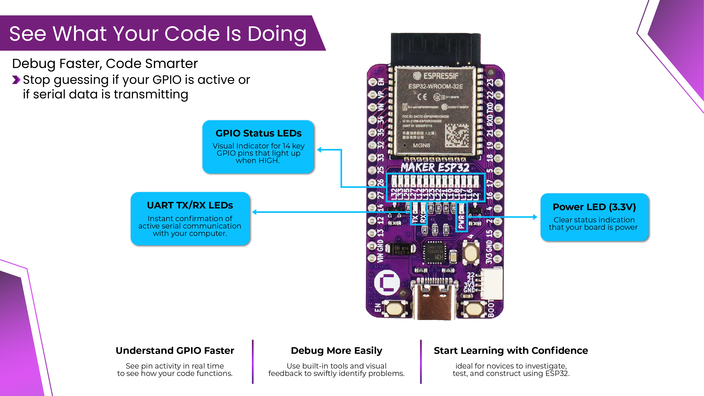
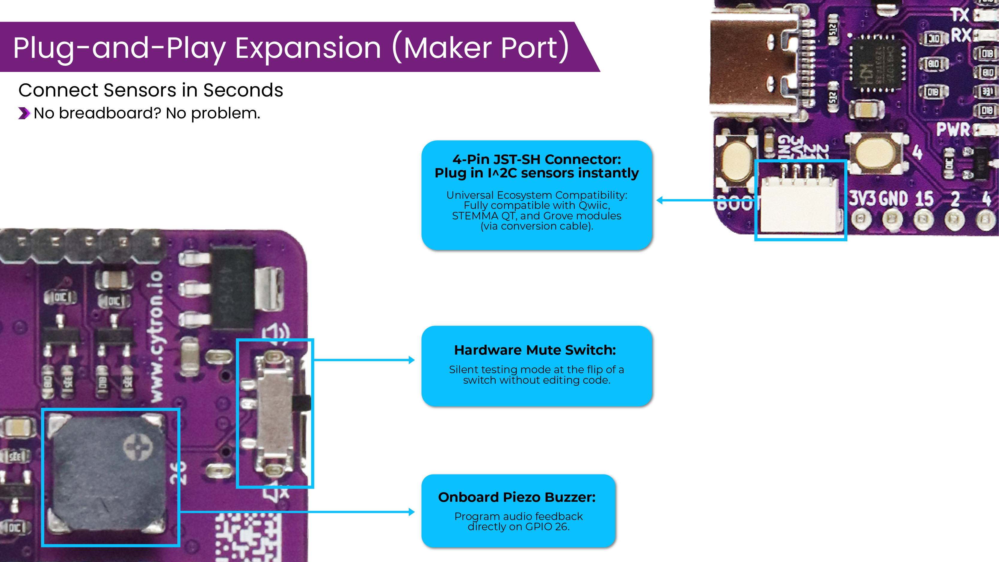
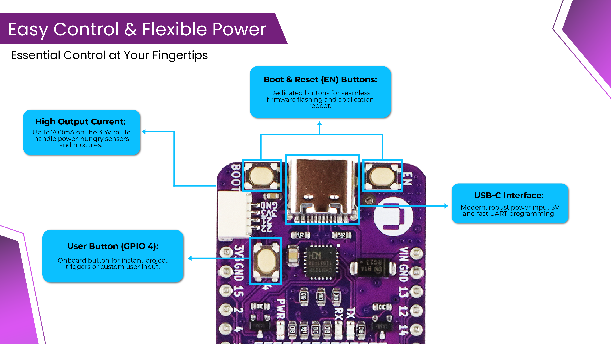
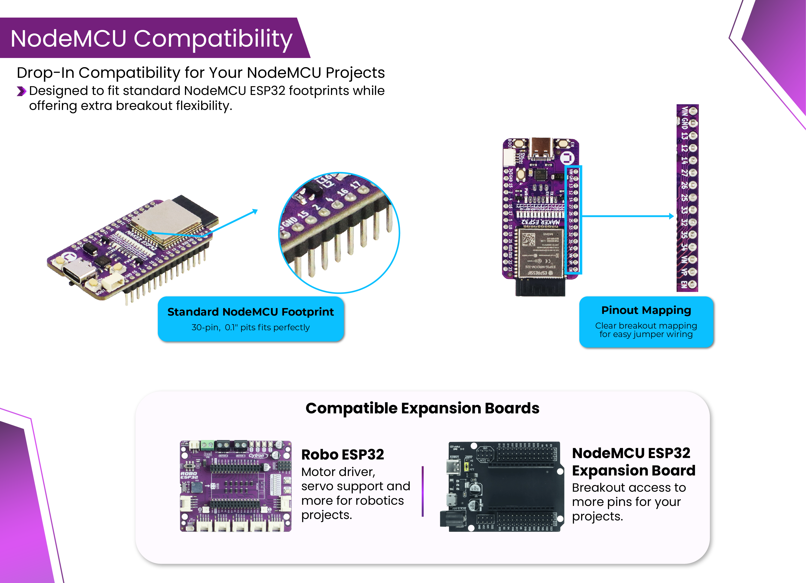

# Cytron Maker ESP32 - Simplifying ESP32 for Beginners
The Maker ESP32 is designed to take the frustration out of building smart electronics and IoT projects. While standard development boards leave you guessing when code fails, this board gives you instant visual and audio feedback right out of the box. Whether you are writing your first lines of code, teaching a classroom, or prototyping a connected device, the Maker ESP32 helps you understand what your board is doing at every step.

## Requirements

**Hardware:**
- [Maker ESP32](https://my.cytron.io/p-maker-esp32)

**Software:**
- [Arduino IDE](https://www.arduino.cc/en/software/)

## Features

## Getting Started

- [Getting Started with Maker ESP32](https://my.cytron.io/tutorial/getting-started-with-maker-esp32?tracking=maker-esp32-t&utm_campaign=makeresptutorial)
- [Learn More](https://my.cytron.io/maker-esp32)

## Documentation

- [Maker ESP32 Datasheet](https://docs.google.com/document/d/1gvGrlrWyXXZk_k-CQ-no0y23ifWEjb_XfbZtomaShDo/edit?tab=t.0)

## Support

If you need further assistance, we welcome you to our [technical forum](http://forum.cytron.io) or contact us through email support@cytron.io where our team will gladly assist you.

Let's start building with Maker ESP32!
